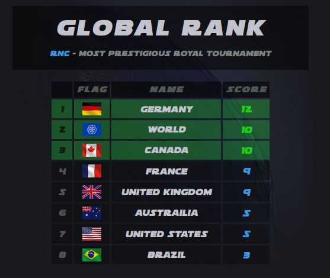
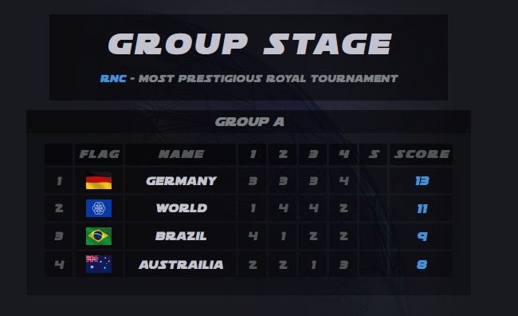
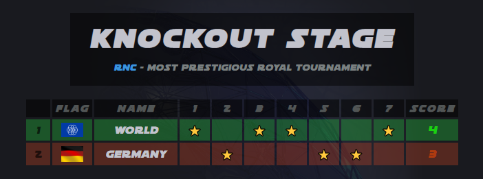
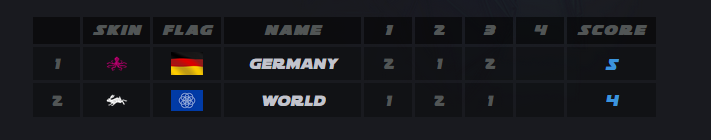
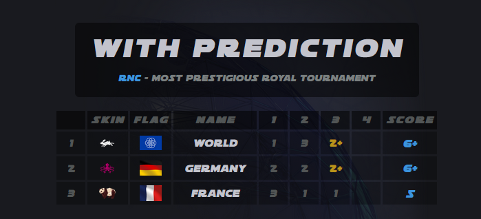
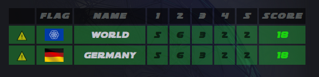
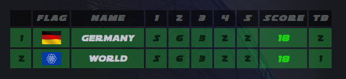
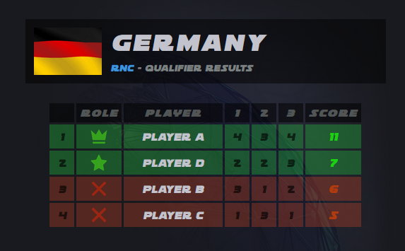

# RNC - Royal Nations Cup

Website with live leaderboards for RNC, developed by Zssork with the help of Brimarine.

## Index

The index page shows allows navigating to the leaderboards. A leaderboard has to set `"enabled": true` in order to be available in the index page. Else the button will be disabled and not clickable.

## Map Pool Generator

A random map pool can be generated on [here](https://royalnationscup.github.io/MapPoolGenerator.html?rounds=5&matches=4). The number or matches and rounds can be configured with a query parameter. The map will be random and diffrent every time when opening the site (so the generated order cant be shard with a link at the moment)

## Flags

Flags are from Nado and can be found at `assets/flags`. They should probably follow the [iso alpha-3](https://en.wikipedia.org/wiki/ISO_3166-1_alpha-3) standard but have not checked xdd

## Leaderboard
The leaderboard is fetching data from [npoint.io](https://www.npoint.io). To fetch from a specific endpoint add a `npoint` url parameter with the value of the npoint id. So for example `&npoint=efc43aed2665ee53a7d6` will fetch from `https://api.npoint.io/efc43aed2665ee53a7d6`.


### Global Rank example:



```
{
   // Title will showw in a box above the leaderboard
   "title": "Global Rank",
   "subtitle": "Most prestigious royal tournament",
   // if this can be accessed from the index page (opening url directly is still possible though)
   "enabled": true,
   // Leaderboard can consist of more sub-leaderboards or groups
   "groups": [
      {
         // When setting a title a box with the title will appear around the table
         "title": "",
         // applies a offset to the position (1 means to start at position 1)
         "startPosition": 1,
         // array of positions to display in a green color
         "successPositions": [1, 2, 3],
         // array of positions to display in a red color
         "dangerPositions": [],
         "kiraMode": false,
         "entries": [
            {
               "name": "World",
               "flag": "WOR",
               "points": 10
            },
            {
               "name": "Germany",
               "flag": "GER",
               "points": 12
            },
            {
               "name": "Austrailia",
               "flag": "AUS",
               "points": 5
            },
            {
               "name": "Brazil",
               "flag": "BRA",
               "points": 3
            },
            {
               "name": "Canada",
               "flag": "CAN",
               "points": 10
            },
            {
               "name": "France",
               "flag": "FRA",
               "points": 9
            },
            {
               "name": "United States",
               "flag": "USA",
               "points": 5
            },
            {
               "name": "United Kingdom",
               "flag": "GBR",
               "points": 9
            }
         ]
      }
   ]
}
```

### Group Stage example:



```
{
   "title": "Group Stage",
   "subtitle": "Most prestigious royal tournament",
   "enabled": true,
   "groups": [
      {
         "title": "Group A",
         "startPosition": 1,
         "successPositions": [],
         "dangerPositions": [],
         "kiraMode": false,
         "entries": [
            {
               "name": "World",
               "flag": "WOR",
               "points": [1, 4, 4, 2, 0]
            },
            {
               "name": "Germany",
               "flag": "GER",
               "points": [3, 3, 3, 4, 0]
            },
            {
               "name": "Austrailia",
               "flag": "AUS",
               "points": [2, 2, 1, 3, 0]
            },
            {
               "name": "Brazil",
               "flag": "BRA",
               "points": [4, 1, 2, 2, 0]
            }
         ]
      }
   ]
}
```

### Knockout example:



```
{
   "title": "knockout stage",
   "subtitle": "Most prestigious royal tournament",
   "enabled": true,
   "groups": [
      {
         "title": "",
         "startPosition": 1,
         "successPositions": [1],
         "dangerPositions": [2],
         // Kira mode will turn all points into stars when greater 0
         "kiraMode": true,
         "entries": [
            {
               "name": "World",
               "flag": "WOR",
               "points": [1, 0, 1, 1, 0, 0, 1],
            },
            {
               "name": "Germany",
               "flag": "GER",
               "points": [0, 1, 0, 0, 1, 1, 0],
            }
         ]
      }
   ]
}
```

### Animal skin example:

Skins can be added with the `"skin"` property. The names have to match with the images in `assets/animals`. Example clownfish is `clown_fish` but grasshopper is `grasshopper`.



```
   {
      "name": "World",
      "flag": "WOR",
      "skin": "rabbit",
      "points": [1, 2, 1, 0]
   },
   {
      "name": "Germany",
      "flag": "GER",
      "skin": "octopus",
      "points": [2, 1, 2, 0]
   }
```

### Predictions example:

By enabeling the `"predictions"` property you can use `"TBD"` as a point value inside the `"points"` property. `"TBD"` means the value is To-Be-Decided. With a max value of 1 existing the next value will be at least 2.



```
{
   "title": "With Prediction",
   "subtitle": "Most prestigious royal tournament",
   "enabled": true,
   // allows predictions to work across all groups
   "linkPredictions": true,
   "groups": [
      {
            "title": "",
            "startPosition": 1,
            "kiraMode": false,
            // enables predictions for this group
            "predictions": true,
            "entries": [
               {
                  "name": "World",
                  "flag": "WOR",
                  "skin": "rabbit",
                  "points": [1, 3, "TBD", "TBD"]
               },
               {
                  "name": "Germany",
                  "flag": "GER",
                  "skin": "octopus",
                  "points": [2, 2, "TBD", "TBD"]
               },
               {
                  "name": "France",
                  "flag": "FRA",
                  "skin": "panda",
                  "points": [3, 1, 1, "TBD"]
               },
            ]
      }
   ]
}
```

### Tiebreaker example:

With the exact same points there will be a tie to break. Example:

```
   {
      "name": "World",
      "flag": "WOR",
      "points": [5,6,3,2, 2]
   }, {
      "name": "Germany",
      "flag": "GER",
      "points": [5,6,3,2, 2]
   }
```




To resolve this add a new property tiebreaker. In this example Germany won over world:

```
   {
      "name": "World",
      "flag": "WOR",
      "points": [5,6,3,2, 2],
      "tiebreaker": 1
   }, {
      "name": "Germany",
      "flag": "GER",
      "points": [5,6,3,2, 2],
      "tiebreaker": 2
   }
```
(Same is possible with the Team pages as well)



## Team pages
The team pages are also fetching data from [npoint.io](https://www.npoint.io). To fetch from a specific endpoint add a `npoint` url parameter with the value of the npoint id. Also required is a flag id to identify the team. Add eg. `id=GER` as a parameter to fetch the German team.



```
{
  "teams": [{
    // display title
    "title": "Germany",
    // display subtitle
    "subtitle": "Qualifier Results",
    // flag MUST match with the flag of the Leaderboard and is used as id
    "flag": "GER",
    // When true the rounds get hidden
    "hideRounds": false,
    // If the auto or manually assigned roles should show
    "assignRoles": true,
    "player": [
      {
        // player name
        "name": "Player A",
        // How many points this player scored (array of numbers to sum up or simple number)
        "points": [4, 3, 4],
        // player with most points so he will be captain (1=captain 2-3=player others out)
      },
      {
        "name": "Player B",
        "points": [3, 1, 2],
        // optional parameter that lets you override the auto assigned roles ("out", "player", "captain", "none")
        "role": "out"
      },
      {
        "name": "Player C",
        "points": [1, 3, 1],
      },
      {
        "name": "Player D",
        "points": [2, 2, 3]
      }
    ]
  }]
}
```

## Additional notes

> To change the default end point edit the **href** in the `index.html`.
> Another one is also in `LeaderBoard.html` for the team pages  

## Font
Website is using the [soloist](https://www.cdnfonts.com/soloist.font) font